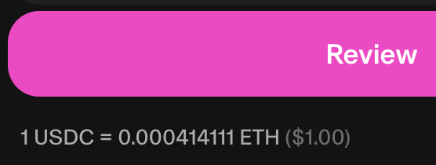
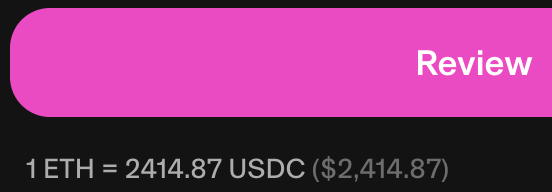

# Introduction

## Background

Options in crypto have exploded recently in usage and types of
approaches. Across 24-hour averages, over \$6B of trading volume occurs
in perpetual markets. In addition, Deribit was recently purchased by
Coinbase for nearly \$3B. This is unsurprising and can see a ramp-up to
catch up to the traditional finance market as the traditional finance
market sees \$2.7T USD in daily notional trading in the options market
and \$600B in daily open interest.

The DeFi space still has room to grow but one issue may be holding it
back from growth: early exercisable (American) options do not exist in a
liquid, decentralized, tokenized manner which will allow options to
become as commonplace in the DeFi ecosystem as yield generating tokens.
Early exercise is an added benefit in options because it gives
in-the-money holders an incentive to exercise early.

To solve this, we introduce the Greek.fi protocol, the first fully
decentralized, collateralized, tokenized, exercisable, expirable options
protocol in the Ethereum ecosystem. The protocol achieves the following,
which fulfill the requirements for an American options:

- Fully ERC20 compatible - allowing full composability

- Fully collateralized protocol so that every option can be exercised to
  swap for the collateral

- Exercisable so that the option holder can swap consideration tokens
  for the collateral

- The option writer can redeem consideration prior to expiration

- The option writer can redeem collateral post expiration

- The option writer can redeem collateral prior to expiration if they
  also own the option

- Two tokens/contracts drive the protocol (LONG and SHORT) similar to
  yield platforms

- Oracle-free, margin-free

This protocol will unlock a trove of possibilities to DeFi, for example:

- Hedge short-term and long-term risk as well as take on risk

- Use leverage without getting margin called

- Earn yield through covered calls

- Create exotic options strategies

- Create unique underlying swap pairs beyond USD bases

- Transfer options from within ecosystems to other ecosystems

- Trade options in both OTC and other markets

- Cash Settlement through flash-loans

# Protocol Overview

The Greek.fi protocol uses a contract factory, allowing upgradability,
which creates a new pair (SHORT and LONG) of ERC20 contracts/tokens for
each option type created (i.e. WETH/USDC, WBTC/USDC). The pair token
creation provides ERC20 composability in SHORT and LONG, a necessity in
the adoption of options as tokens. The pair provides a minting interface
where depositing collateral tokens returns SHORT and LONG tokens. Each
option pair is represented by a tuple of the following parameters:
$$(Collateral, Consideration, Strike, Expiration, isPut).$$

In Options, Collateral is the underlying asset that the option holder
has the right to purchase, while Consideration is the asset paid in
exchange for the Collateral. They are both represented by contract
addresses. The Expiration is the last date the option can be exercised.
It is represented as a Unix timestamp, similar to block timestamps. The
Strike is the price at which the option can be exercised. The Strike is
represented as a ratio of the Consideration to the Collateral with an
additional temporary multiplier of $10^{18}$ as a buffer since solidity
does not support decimals. The boolean, isPut, indicates if the option
is a Put option, which is only for vanity. This protocol allows the
collateral and consideration to be any ERC20 asset, meaning USDC and
WETH could be collateral/consideration or consideration/collateral. This
flexibility removes any special complications of Put options. Only the
front end handles inverting the Strike price for the user (i.e., 1000
USDC for 1 WETH is represented as 1 USDC for .0001 WETH). This is
similar to how Swapping platforms visualize the price, where it is
inverted when clicked. In the future, there may be a way to
automatically determine if a pair is considered a Put or Call, but a
puzzle to the reader, is WETH/WBTC a call or a put?

<figure id="fig:swaps">
<figure id="fig:swap1">

<figcaption>Swap 1</figcaption>
</figure>
<figure id="fig:swap2">

<figcaption>Swap 2</figcaption>
</figure>
<figcaption>Swap diagrams</figcaption>
</figure>

The LONG and SHORT contracts are coupled to each other, meaning every
interaction with the LONG token will interact with the SHORT token. The
proper movement of collateral and consideration through exercise and
redemption is heavily dependent on this coupling.

The diagram below is a visual representation of an exercise, a coupled
process. In order to exercise the SHORT option, the user's consideration
is swapped for the collateral held by the SHORT contract.

{#fig:exercise width="50%"}

## LONG Token

The LONG token represents the long position of the option holder,
entitled to purchase the underlying collateral asset when exercising the
option. Simply put, the LONG token is the so-called \"Option\" in the
traditional options world.

The LONG token can only be exercised before expiration. After
expiration, the LONG token is unusable and deemed worthless. We leave
room to burn expired tokens so they aren't used for scams.

The LONG token can be traded on DEXs/AMMs and traded on RFQs. They can
also be used for OTC trades between private parties.

Other than standard ERC20 functionality, the LONG token permits a user
to **exercise** the option and **redeem** the underlying collateral if
and only if they hold the SHORT token as well. The **lock** and
**unlock** functions are also available to prevent and allow exercise -
this feature is for vesting or credit default swaps.

::: {#tab:functions}
  **Function**      **Description**
  ----------------- ----------------------------------------------------------------
  mint()            Mints LONG and SHORT tokens by depositing collateral.
  exercise()        Exercises the option by swapping consideration for collateral.
  redeem()          Redeems collateral before expiration if also holding LONG.
  lock()/unlock()   Locks/unlocks to prevent/allow exercise.

  : Available functions for LONG token
:::

## SHORT Token

The SHORT token represents the short position of the option writer,
obligated to sell the underlying collateral asset for the consideration
asset when the LONG option is exercised. In TradFi, when an option is
written and sold, the account shows a negative balance of the option. We
represent this position with the SHORT token.

#### SHORT is Put? {#short-is-put .unnumbered}

The SHORT token is not a Put option. It is a short position in the
option trade. Being short does represent an expected negative outlook on
the Collateral asset wrt the Consideration asset, which is similar to a
Put option but they are not the same.

The SHORT token also represents a long position in the underlying
Collateral asset by locking up the underlying collateral asset in the
SHORT token. This token structure not only represents a covered call,
but is the only way to provide the ability to exercise the protocol.
This is the first step to providing a fully collateralized protocol. The
SHORT token is also able to redeem the underlying collateral asset after
expiration.

The SHORT token provides an ability to redeem the underlying collateral
asset after expiration. Additionally, prior to expiration, the SHORT
token provides the ability to redeem the consideration asset after LONG
holders exercise. And finally, if a SHORT holder also owns the LONG
token, they can redeem the collateral prior to expiration (this is gamma
neutral).

::: {#tab:functions}
  **Function**            **Description**
  ----------------------- --------------------------------------
  redeem()                Redeems collateral after expiration.
  redeemConsideration()   Redeems consideration if available.

  : Available functions for SHORT token
:::

## Capital Efficiency

At this point, one may wonder about the capital efficiency (CE) of the
protocol. This requires a couple of additional pieces to be added
outside of the protocol. One requirement for CE is for the SHORT token
to be used as collateral for loans for the underlying asset. Lending
protocols are willing to lend against an asset if a few conditions are
met. The two that are not very clear in this protocol are:

- The asset has a market, i.e., is liquid

- The asset has a price feed, i.e., an oracle

To clarify, the protocol has no Oracle included and no margin ability.
Many protocols use margin and use cash settling to settle the option.
This prevents the ability to exercise the option and gain collateral.

This protocol presents a few interesting challenges to price feeds and
liquidity. Firstly, liquidity is a necessity so that the lending
protocol can sell the asset in the case of a margin call. Secondly, a
price feed is necessary to determine if the loan is at risk of being
called.

If the lending protocol restricts the loan to provide only the
underlying collateral or the consideration asset, the lenders have two
regimes of the price of the Collateral to consider: when the price of
the collateral is above the strike price, and when the price of the
collateral is below the strike price. Below Strike (K), SHORT is worth
P, the price of the collateral. Above Strike (K), SHORT is worth only K
because the consideration has been paid through exercise. The chart
below shows the price of the SHORT token in those regimes with a Strike
of 3000.

{#fig:short_price width="50%"}

The combination of the two regimes is not linear and the price feed
needs to provide a version of this non-linearity or the lender needs to
account for it. More importantly, the more realistic price of the SHORT
token incorporates the market price of the LONG token, as seen as the
orange curve solid line in the chart above. Again, another consideration
for the oracle, but for assets that have low volume, an extreme fair
price can be used by really shifting the LONG token price component as
seen by the green dot-dashed line in the chart above.

#### Margin Call Mechanics {#margin-call-mechanics .unnumbered}

If the lender needs to margin call against the SHORT token, there are
two options: 1. The Lender can buy the coupled LONG token, redeem the
resulting collateral and either swap it or use it to pay back the loan.
2. If there's a liquid market for the SHORT token, immediately sell it
to cover the loan, with a possibility of using the proceeds to buy the
borrowed collateral.

## Fees

The protocol reserves the possibility of fees in the future at various
places related to the protocol. Anything around 1 bip would be
considered, with a tapering ($\log(volume)$) to incentivize large
volumes.

- Protocol fee, where anything around 1 bip on minted options would be
  considered.

- AMM fee, where a revenue share would be split with Liquidity
  Providers.

- Exercise fee, where a fee would be charged on the exercise of the
  option.

- Vault fee, where a fee would be charged for the vault management.

# Applications and Future Considerations

#### AMM {#amm .unnumbered}

The protocol tokens can be used in an AMM, thus creating a market for
the options, as well as the short positions if desired.

#### Default Swaps {#default-swaps .unnumbered}

The protocol is able to provide default swaps as insurance for risk
management in debt markets. An Oracle or Third party can **unlock** the
LONG token to allow exercise.

#### Cash Settlement {#cash-settlement .unnumbered}

If stock settlement/exercise feature is not really needed in the space
and margin is desired, then the composable nature of the protocol can be
used to create a margin protocol through the mechanics described above.

#### Interoperability across chains {#interoperability-across-chains .unnumbered}

In the context of the Optimism Superchain, we leave room for the
protocol to handle an ability to be interacted with across chains. This
means that exercising will involve movement of collateral and
consideration across chains. There's no free lunch with the interop, but
the protocol can be upgraded to handle this with careful design.

#### Option Drops instead of Token drops {#option-drops-instead-of-token-drops .unnumbered}

In TradFi, options are vested by startup employees and exercised for tax
purposes. A similar use case can be made here to provide option drops
instead of token drops.

#### Compound Options {#compound-options .unnumbered}

A compound option is an option on an option. Yes, this is a thing. It's
basically a second derivative. And yes, this protocol can handle it.

#### Trading {#trading .unnumbered}

Once options are minted, the obvious question is how to trade them. We
have considered using a DEX AMM, such as Uniswap, but options could have
low volume and low liquidity. This can cause slippage and nobody wants
that.

The obvious solution is to use RFQs, such as 0x, Bebop, etc. This allows
for the options to be traded at a price that is determined by the
market. This would allow partnering with market makers to provide
liquidity for the options. This would also solve pricing the options
where the MMs set their own prices. This will create a new market maker
ecosystem.

#### Short Token Trading {#short-token-trading .unnumbered}

The SHORT token represents two things: Collateral/consideration
ownership and a short position in the option trade. Let's say you sold
an in the money call (WETH at 3000 expiring soon). When you sold your
LONG token you received a premium of 1000 USDC in addition to IV and
Time Value. This is potentially priced in the SHORT token making it
tradable since it has a value.

#### Vaults {#vaults .unnumbered}

Vaults allow for more complex strategies using the options protocol.
This simplifies the experience for users and reduces the amount of work
required to implement these strategies.

#### Covered Call Vaults {#covered-call-vaults .unnumbered}

One strategy, such as covered call vaults, which allow for the creation
of options with a portion of the collateral as the option premium. A
simple strategy could involve users depositing WETH as collateral, and
then the vault handles:

1.  minting options with the collateral

2.  selling the options

3.  let the options expire worthless

4.  redeem the collateral

5.  Go to step 1

This strategy is nearly identical to ETF strategies (i.e., XYLD).
Covered call vaults do not exist on chain, but this protocol allows for
the creation of these strategies. This same strategy can be applied for
Covered Put vaults, where the vault mints the put options and sells
them.

#### Margined Options Vaults {#margined-options-vaults .unnumbered}

Similar to covered call vaults, margined options vaults allow for the
minting of call options using collateral. Afterwards, the vault takes a
loan on the collateral (AAVE, Silo, etc) and uses the proceeds to mint
more options. This allows for the vault to mint more options than it
would have been able to otherwise. This is also extremely risky as the
vault is exposed to the risk of the collateral asset price.

#### Cash Settled Options {#cash-settled-options .unnumbered}

Using cash-equivelent from a flash loan, a contract can be exercised for
collateral which in turn is swapped for the original cash equivelent.
This whole process can be wrapped in a separate contract and triggered
by an external party near expiration time.

# Appendix

::: acknowledgments
We wish to acknowledge the support of the DeFi community in developing
the Greek.fi Protocol, offering suggestions and encouragement, testing
new versions, and providing valuable feedback on the design and
implementation.
:::

## Key Concepts

- **Call Option**: Right to buy an asset at a specified price before
  expiration

- **Put Option**: Right to sell an asset at a specified price before
  expiration

- **Strike Price**: The price at which the option can be exercised

- **Expiration Date**: The last date the option can be exercised

- **LONG Token**: Represents the right to exercise the option

- **SHORT Token**: Represents the obligation and right to the collateral

Options need the following abilities to be considered American style:

- Expirable at some future fixed date

- Exercisable so that the option holder can swap consideration for
  underlying collateral prior to expiration

- The option writer can use the collateral freely after expiration,
  unless\...

- The contract written has been exercised, providing consideration to
  the option writer to be used freely

# Example: Minting Options

1.  Connect your wallet to the protocol

2.  Select option parameters:

    - Collateral Asset: WETH

    - Consideration Asset: USDC

    - Strike Price: 5000 USDC

    - Expiration Date: 30 days

    - Option Type: Call

3.  Mint and approve the LONG contract to capture your WETH

4.  Receive LONG and SHORT tokens
