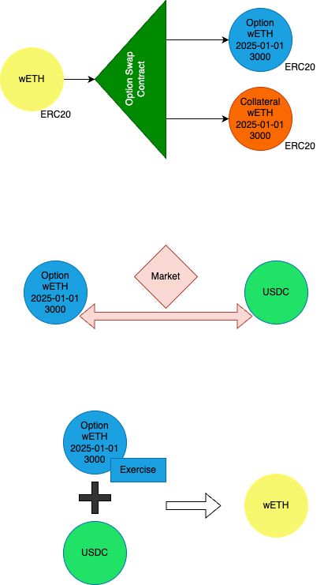

# Fully Collateralized DeFi Options
## Technical White Paper v1.0

### Abstract
We present a decentralized options protocol built on EVM-compatible blockchains that enables the creation, trading, and settlement of fully collateralized options contracts, calls and puts. The protocol supports any ERC20 token or native currency as the underlying asset, with settlement in ERC20 tokens also, including stablecoins such as USDC. Our design prioritizes security, capital efficiency, and composability/modularity while eliminating counterparty risk through full collateralization.

### 1. Introduction
#### 1.1 Background
Traditional options markets require trusted intermediaries and expose participants to counterparty risk. Decentralized finance (DeFi) enables the creation of trustless, transparent options markets where smart contracts enforce the terms and hold collateral.

Most options platforms and centralized exchanges which offer options are not fully collateralized. They are not secure and expose users to counterparty risk. The ability to move positions between platforms is limited and the ability to earn yield on collateral by selling covered calls is virtually non-existent. We leave the exploration of current options platforms and centralized exchanges to the appendix.

#### 1.2 Motivation

By introducing a smart contract into the options system, we have to break down the process into steps that differ from traditional options. We have to account for the fact that the smart contract will hold the collateral and that the process of exercising and settling options will be done through the smart contract.

This departure from tradition requires a new way of thinking about options and the role of the smart contract. 
Most options experts assume margin accounts and clearing counterparty to handle all the mechanics of options: collateral, exercise, settlement, etc. In a way, the onchain system can be interpreted more easily than the traditional systems that make many assumptions.

#### 1.3 Call Options

A call option is a contract that gives the buyer the right to buy a certain amount of an underlying asset (ASSET) prior to an expiration date (EXP) at a specified price (STRIKE) of a purchasing currency (CURNCY). The seller of the call option is obligated to sell the underlying asset if the buyer decides to exercise the option priot to the expiration date. 

| Variable | Description |
|----------|-------------|
| ASSET    | The underlying asset that the option is written on. |
| CURNCY   | The currency that the option is priced in. |
| STRIKE   | The price of the underlying asset that the option gives the buyer the right to buy. |
| EXP      | The date the option expires. |

Traditional Example: Alice owns 2 ETH and wants to write options on her position. She writes a call option on her position with a strike price of 3000 USD and an expiration date of 30 days from now. Bob buys the option from her. Bob now has the right to buy 2 ETH from Alice at the price of 3000 USD per ETH prior to the expiration date.

#### 1.4  Call Options on Chain
Example: Alice owns 2 wETH and wants to write options on her position. She decides to write a call option with a strike price of 3000 USD and an expiration date of 30 days from now. 

Alice deposits 2 wETH into the Option Swap Contract (OSC) as collateral. The OSC mints and transfers 2 Call Option Tokens (OP) and 2 Collateral Tokens (COL) to Alice that represents her position. 

Alice lists the OP for sale on a market (Uniswap etc.) and Bob buys the option from Alice. Bob has the choice to either hold the OP or sell it on the market if the price moves in his favor. 

From Bob's perspective, there are three possible outcomes:

1. Bob allows the OP to expire.
2. Bob sells the OP on the market before expiration.
3. Before expiration, Bob interacts with the OP smart contract to exercise the option by depositing USDC and receiving wETH.

From Alice's perspective, there are two possible outcomes:

1. After expiration, 
    1. Alice can claim the underlying asset (wETH) from the OSC, or if all the collateral has been exercised...
    2. Alice can claim the purchase currency (USDC) from OSC.
2. Before expiration, 
    1. Alice can buy back the OP from the market and withdraw her collateral by burning the OP and the COLs
    2. Alice can sell the COL on the market.

The OSC allows anyone to bring any ERC20 token as collateral and write options on it. This is a powerful feature that allows for a wide range of options to be written on any ERC20 asset.

